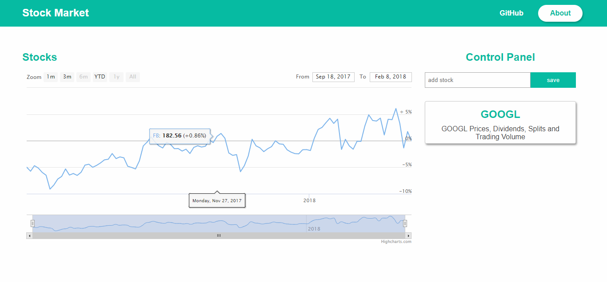
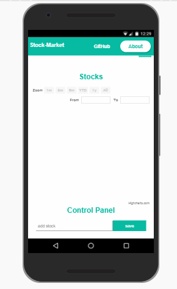

# Stock Market
FreeCodeCam backend Project || Application that provide stock market data and allow users to add and remove stocks  and also have a realtime data update.


## phone view


## [User Stories](https://www.freecodecamp.org/challenges/chart-the-stock-market)

- User Story: I can view a graph displaying the recent trend lines for each added stock.

- User Story: I can add new stocks by their symbol name.

- User Story: I can remove stocks.

- User Story: I can see changes in real-time when any other user adds or removes a stock. For this you will need to use Web Sockets.

## Built with
Frontend:
- [Reactjs](https://reactjs.org/) - A JavaScript library for building user interfaces

- [highcharts](https://www.highcharts.com/) - charts

Database:
- [Mongodb](https://www.mongodb.com/) - NoSql Database

backend:
- [Nodejs](https://nodejs.org/en/) - JavaScript runtime built on Chrome's V8 JavaScript engine.
- [Express](http://expressjs.com/) - Nodejs application framework

API:
- [alpha vantage](https://www.alphavantage.co/) - help connect consumers with great local businesses!

## Installation

### Prerequisites

| Prerequisite                                          | Version |
| ------------------------------------------------------| ------- |
| [MongoDB Community Server]                            |    --   |
| [Node.js](http://nodejs.org)                          | `~ ^8`  |
| npm (comes with Node) or yarn (used)                  | `~ ^5`  |
| [alphavantage API_KEY](https://www.alphavantage.co/)  |    --   |

```shell
node -v
mongo --version
```
#### Cloning the repo

1. Open a Terminal in your projects directory 
2. Clone this repo

```shell
$ git clone https://github.com/jesusantguerrero/stock-market.git
```

### setup
```bash
# Install NPM dependencies
npm install 
# or If you like yarn
yarn

```

copy .env.example to .env and change the API KEY:

```bash
# Remember place your alpha vantage API_KEY there:
cp .env.example .env
```

### running

```bash
# Start the mongo server in a separate terminal
mongod

# Run the app
npm start

# If you're going to explore the front-end you need to run both npm start for backend and nmp run dev 
# to run react development mode
# start the application
npm start
npm run dev
```
